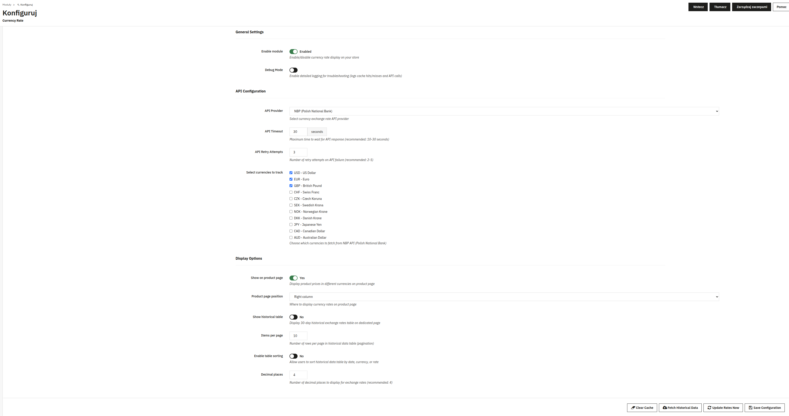

# Currency Rate Module

Moduł PrestaShop do wyświetlania aktualnych kursów walut oraz danych historycznych z Narodowego Banku Polskiego (NBP).

## 📋 Opis

Moduł Currency Rate umożliwia:
- 📊 Wyświetlanie aktualnych kursów walut (USD, EUR, GBP, CHF itp.)
- 📈 Przeglądanie historycznych danych kursów walut
- ⚡ Wykorzystanie cache (Memcached) dla optymalizacji wydajności
- 🔄 Integrację z API NBP (Narodowy Bank Polski)
- 🎨 Responsywny interfejs użytkownika z wykresami

## 🚀 Jak uruchomić projekt

### Wymagania

- Docker
- Docker Compose
- Make

### Instrukcja uruchomienia

1. **Sklonuj repozytorium**
   ```bash
   git clone <repository-url>
   cd example-currency-rate
   ```

2. **Skopiuj plik konfiguracyjny**
   ```bash
   cp .env.dist .env
   ```

3. **Uruchom środowisko Docker**
   ```bash
   make rebuild
   ```

4. **Sprawdź logi i poczekaj aż PrestaShop się uruchomi**
   ```bash
   docker compose logs -f prestashop
   ```

5. **Zainstaluj moduł**
   ```bash
   make install
   ```

6. **Skonfiguruj Memcached (opcjonalnie, zalecane)**
   ```bash
   make configure-memcached
   ```

7. **Przetestuj czy cache działa**
   ```bash
   make test-memcached
   make test-cache
   ```

### Dostęp do aplikacji

- **Frontend modułu:** http://localhost:8080/module/currencyrate/display
- **Panel administracyjny:** http://localhost:8080/admin-dev
    - Login: `admin@prestashop.com`
    - Hasło: `prestashop`

Dla wygody dodany jest link do modułu w menu na stronie głównej.

## ⚙️ Konfiguracja modułu

W panelu administracyjnym PrestaShop przejdź do:
**Modules → Module Manager → Currency Rate → Configure**

Dostępne opcje konfiguracyjne:



### Parametry konfiguracji:

- **Domyślne waluty**: Lista kodów walut do wyświetlania (np. USD,EUR,GBP)
- **Automatyczna aktualizacja**: Włącz/wyłącz automatyczne pobieranie kursów
- **Interwał aktualizacji**: Co ile godzin pobierać nowe dane
- **Okres historyczny**: Ile dni wstecz pokazywać dane historyczne
- **Cache**: Czas przechowywania danych w cache (sekundy)

### Zmienne środowiskowe (.env)


## 🛠️ Komendy Make

| Komenda | Opis |
|---------|------|
| `make rebuild` | Przebudowa i restart kontenerów Docker |
| `make up` | Uruchomienie kontenerów |
| `make down` | Zatrzymanie i usunięcie kontenerów |
| `make install` | Instalacja modułu w PrestaShop |
| `make configure-memcached` | Konfiguracja Memcached |
| `make test-memcached` | Test połączenia z Memcached |
| `make test-cache` | Test cache w module |
| `make rebuild-with-cache` | Pełna przebudowa z konfiguracją cache |

## 📁 Struktura projektu


## Do zrobienia w pełnej wersji:
Z racji ograniczenia czasowego do wersji pełnej
- Automatyczna aktualizacja danych poprzez zadanie cron (np. raz dziennie). - Tutaj szedłbym w wersję symfony command
- Tabela z kursami historycznymi powinna posiadać paginacje oraz sortowanie.
- Ikonki modułu + opisy
- cały pakiet testów e2e, unit
- przygotowanie aby ide ( PHPStorm ) podpowiadał klasy z prestashop

- env
```dotenv
# Module configurations
CURRENCY_RATE_DEFAULT_CURRENCIES="USD,PLN,EUR,GBP"
CURRENCY_RATE_AUTO_UPDATE=1
CURRENCY_RATE_AUTO_UPDATE_HOURS_INTERVAL=24
CURRENCY_RATE_HISTORY_DAYS=30
````


